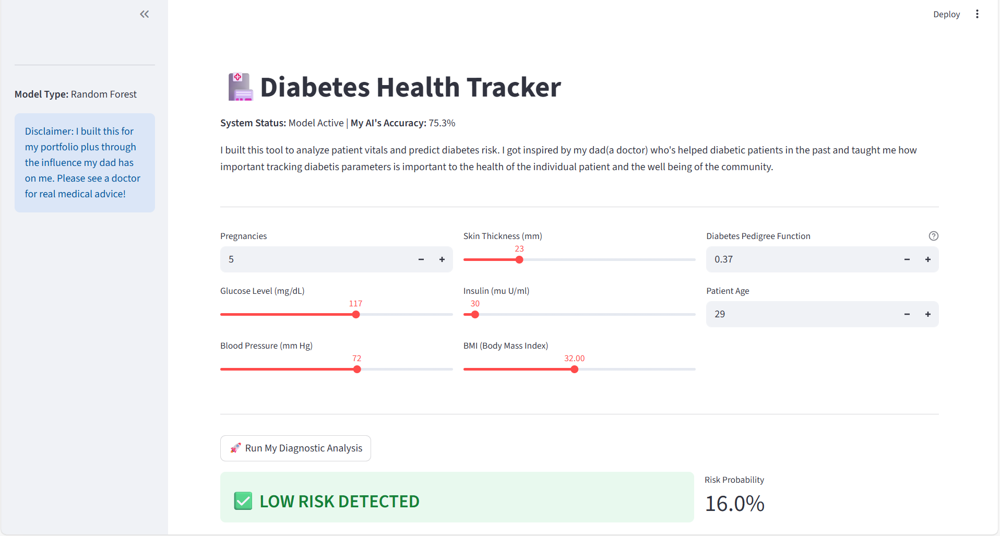
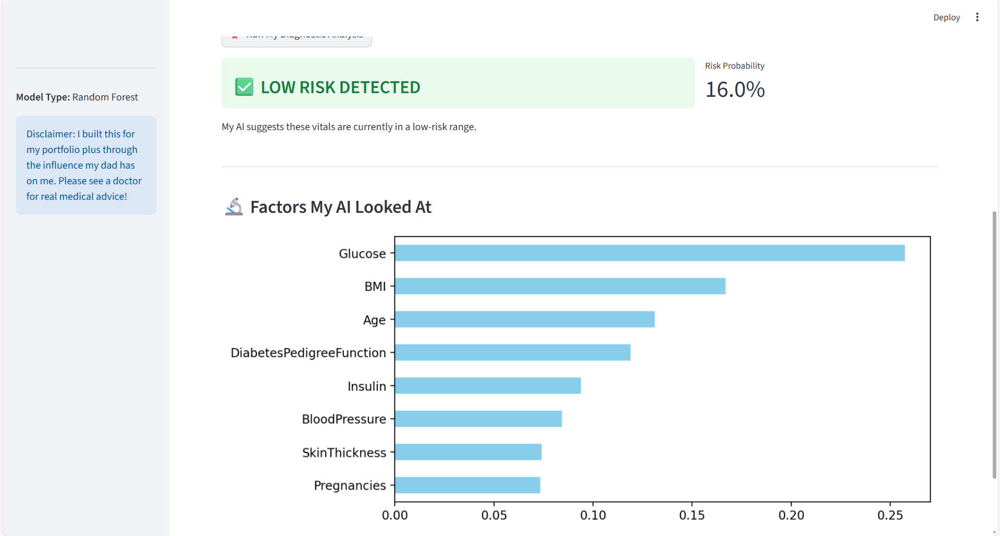

# Diabetes-Health-Tracker
This Diabetes AI Health Tracker is a Machine Learning web application designed to predict diabetes risk by analyzing patient vitals.  Inspired by my father’s medical career and my family's commitment to healthcare, I built this tool using a Random Forest Classifier trained on real-world clinical data.
Key Features
Predictive Analysis: Uses a Random Forest Classifier to assess risk with an accuracy of 75.3%.

Interactive Dashboard: A clean UI built with Streamlit that allows users to input vitals via sliders and number inputs.

Explainable AI: Includes a Feature Importance chart that shows which factors (like Glucose or Age) most influenced the AI's decision.

Smart Data Cleaning: Custom logic to handle "impossible" medical data.

🛠️ Challenges & Technical Solutions
1. The "Zero" Data Issue (Data Imputation)
One of the biggest hurdles was the dataset quality. Many records showed a 0 for Blood Pressure, BMI, and Insulin. Since these are medically impossible for a living patient, I had to fix this "noisy" data.

My Solution: I used Data Imputation to replace these zeros with the Mean (Average) of the column. This improved my model accuracy from ~72% to 75.3%.

2. Clinical Constraints
While this AI is a powerful proof-of-concept, it has specific constraints:

Biomarkers: The 1988 dataset uses a snapshot of Glucose rather than modern HbA1c (3-month average) or Kidney Function (Creatinine) tests.

Dataset Scope: The model is trained on the Pima Indians Diabetes dataset, which is a specific population.

👨‍💻Tech Stack
Logic: Python

Data: Pandas & NumPy

AI Model: Scikit-Learn (Random Forest)

Interface: Streamlit

Visuals: Matplotlib & Seaborn

Installation & Usage
To run this project locally, follow these steps:

Clone the repository:

Bash

git clone https://github.com/your-username/diabetes-ai-tracker.git
Install dependencies:

Bash

pip install streamlit pandas numpy kagglehub scikit-learn matplotlib seaborn
Run the app:

Bash

python -m streamlit run main.py

📜 Disclaimer
This tool is for educational purposes only. It is an AI screening project and should not be used as a substitute for professional medical advice, diagnosis, or treatment. Always consult a qualified healthcare provider for medical concerns.

